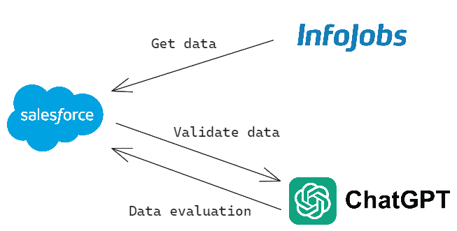
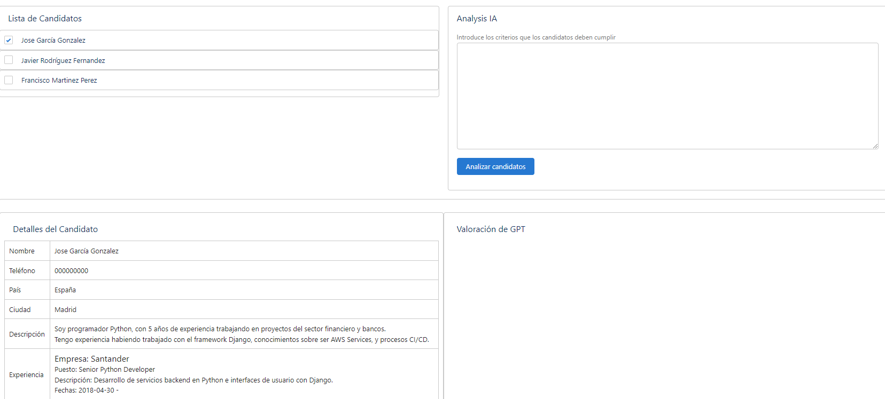
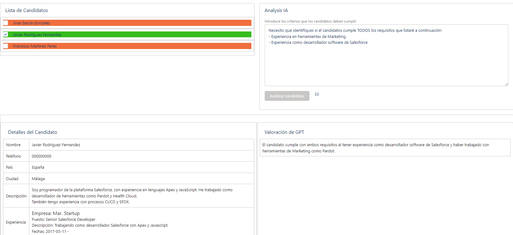

# InfoJobs Hackathon - David Godoy
# Español
## Idea
El proyecto que he decidido desarrollar se basa en una integración compartida con InfoJobs API y OpenAI API, para el procesamiento de curriculums de los candidatos, en una idea de mejorar el rendimiento del personal de recursos humanos cuando deben de procesar cientos o incluso miles de candidatos.

La solución habilita una interfaz flexible con la cual el personal de recursos humanos podrán escribir en lenguaje común cuales son los requisitos que esperan de los candidatos y ChatGPT procesará los curriculums, cruzándolos con las capacidades descritas por recursos humanos. Y todo ello sin las limitaciones que algunas de la herramientas de filtrado actuales posean, ya que se tratan de herramientas estáticas que necesitan un desarrollo incremental para añadir mayor complejidad en los filtros.

He decidido utilizar como plataforma hosting Salesforce, por motivos personales ya que es la tecnología con la que me sentía más cómodo, al ser yo desarrollador Salesforce.

Pero esta idea se podría perfectamente implentar en una aplicación web independiente, una aplicación móvil o desarrollando un servicio middleware que que exponga mediante API soluciones procesadas por ChatGPT a cualquier consumidor.

## Acceso a la plataforma.
Para acceder a la plataforma tendrás que sencillamente seguir los siguientes pasos:

1. Accede a la URL: https://ebury-f-dev-ed.develop.my.salesforce.com/
2. Utiliza el Username: info.jobs.tester@gmail.com.infojobshackathon
3. Introduce la contraseña que compartiré con vosotros a través de un canal distinto por motivos de seguridad.

## Configuración del acceso a las APIs
Para poder probar la solución, primero hay que introducir los API Keys para las integraciones de InfoJobs y OpenAI, para ello sigue los siguientes pasos:

1. Accede a Setup.
2. Desde el buscador escribir "Custom Metadata Types" y seleccionar la susodicha opción.
3. Seleccionar "Manage Records" al lado de la configuración "Token".
4. Editar ambas configuraciones para InfoJobs y OpenAI, e incluir ambos tokens.
5. Asegurarse de guardar ambas configuraciones.

Tenéis un video en la carpeta /videos del repositorio, llamado **configuración-tokens.mp4**, en el que se muestra paso a paso como podéis hacer esta configuración.

> La API de OpenAI tiene un plan gratuito para hacer pruebas, podéis crearos una cuenta gratuita, pero tened en cuenta que hay una limitación de 3 llamadas a la API cada 20 segundos, así que tenedlo en cuenta si optáis por el plan gratuito.

## Prueba de la aplicación web
Para acceder al proyecto del Hackathon, sencillamente tendremos que acceder a la aplicación **InfoJobs Hackathon** donde encontraremos una página o tab llamado **Candidates Selector**.

### Selector de Ofertas
Lo primero de todo, encontraremos un campo en el que podremos introducir el ID de la oferta que queremos procesar. 

Al introducir el ID deseado y hacer click en el botón **Cargar Oferta**, los detalles de la oferta serán cargados:

### Listado de candidatos

Además también encontraremos un listado de candidatos que han aplicado a susodicha oferta, podremos seleccionar cada uno de esos candidatos para poder ver más detalles sobre sus curriculums:

> Por motivos de privacidad este proyecto no tiene acceso a los datos privados de los candidatos de ninguna oferta de InfoJobs, por lo tanto he optado por mockear los resultados creando datos de prueba para demostrar la prueba de concepto de la aplicación.

### Análisis GPT

A parte de todos los datos sobre la oferta y los candidatos y sus curriculums, el usuario también tiene habilitada una entrada de texto, que posibilita el análisis de los candiatos por parte de ChatGPT de OpenAI.

El usuario sencillamente tendrá que añadir cuales son los requisitos o capacidades que necesitan que los candidatos cumplan, y la herramienta IA leerá y procesará todos los curriculums de los candidatos para hacer la operación de filtrado y además devolver una valoración sobre si los candidatos cumplen o no los requisitos.

Tenéis un video en la carpeta /videos del repositorio, llamado **demostracion.mp4**, en el que se muestra paso a paso una demostración de la funcionalidad.

---

# English

## Idea
The project I have decided to develop is based on a shared integration with InfoJobs API and OpenAI API for processing candidate resumes, with the aim of improving the performance of human resources personnel when they have to process hundreds or even thousands of candidates.

The solution provides a flexible interface through which HR personnel can write in plain language the requirements they expect from candidates, and ChatGPT will process the resumes, matching them with the capabilities described by HR. All this without the limitations that some of the current filtering tools have, as they are static tools that require incremental development to add more complexity to the filters.

I have decided to use Salesforce as the hosting platform for personal reasons, as it is the technology I felt most comfortable with, being a Salesforce developer myself.

However, this idea could be perfectly implemented in an independent web application, a mobile application, or by developing a middleware service that exposes ChatGPT-processed solutions through an API to any consumer.

## Access to the Platform
To access the platform, simply follow these steps:

1. Go to the URL: https://ebury-f-dev-ed.develop.my.salesforce.com/
2. Use the Username: info.jobs.tester@gmail.com.infojobshackathon
3. Enter the password that I will share with you through a different channel for security reasons.

## API Access Configuration

To test the solution, you need to first enter the API Keys for the InfoJobs and OpenAI integrations. Follow these steps:

1. Access Setup.
2. From the search bar, type "Custom Metadata Types" and select the corresponding option.
3. Select "Manage Records" next to the "Token" configuration.
4. Edit both configurations for InfoJobs and OpenAI, and include both tokens.
5. Make sure to save both configurations.

There is a video in the /videos folder of the repository, called **configuración-tokens.mp4**, which shows step by step how you can make this configuration.

> The OpenAI API has a free plan for testing purposes. You can create a free account, but keep in mind that there is a limitation of 3 API calls every 20 seconds, so please consider this if you opt for the free plan.

## Web Application Testing
To access the Hackathon project, simply go to the InfoJobs Hackathon application, where you will find a page or tab called Candidates Selector.

### Job Offers Selector
First of all, you will find a field where you can enter the ID of the offer you want to process.

By entering the desired ID and clicking the Load Offer button, the details of the offer will be loaded:

### Candidates List
You will also find a list of candidates who have applied to the aforementioned offer. You can select each of these candidates to see more details about their resumes:

For privacy reasons, this project does not have access to the private data of candidates from any InfoJobs offer. Therefore, I have chosen to mock the results by creating test data to demonstrate the proof of concept of the application.

### GPT Analysis
In addition to all the data about the offer and the candidates and their resumes, the user also has a text input enabled for the analysis of candidates by OpenAI's ChatGPT.

The user simply needs to add the requirements or capabilities they need the candidates to have, and the AI tool will read and process all the candidates' resumes to perform the filtering operation and provide an evaluation of whether the candidates meet the requirements or not.

There is a video in the /videos folder of the repository, called **demostracion.mp4**, in which you will be able to see, step by step, a demonstration of the functionality.
